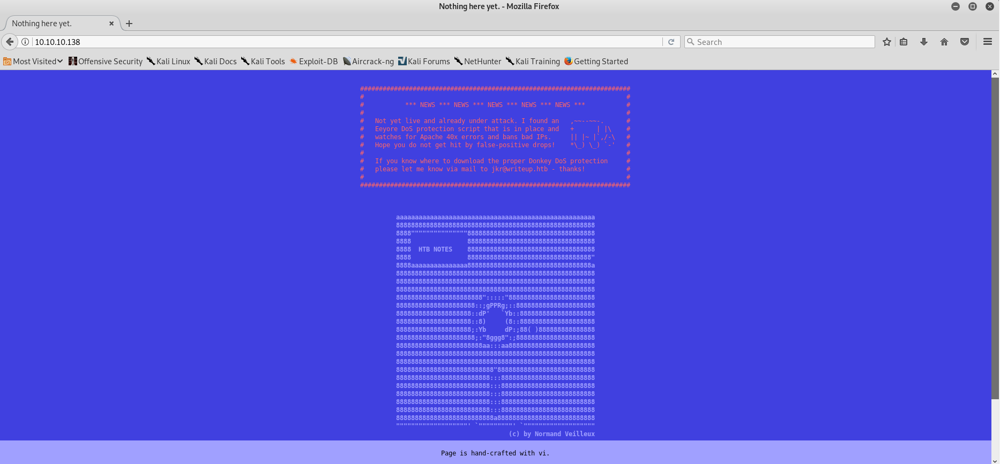
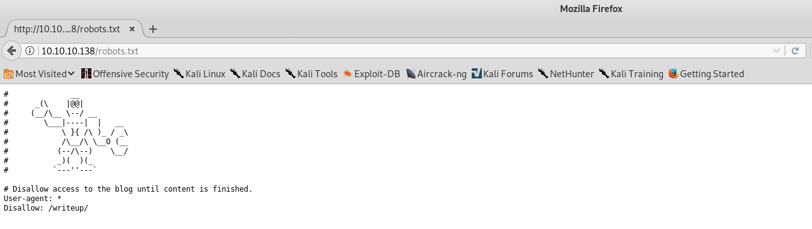
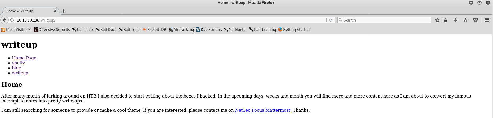

## Welcome to myWriteup!

Hi there!

I am b3yond1xx7 and here's a brief intro about me; 

I am just a newbie in Infosec Industry, Capture-the-flag and also, in doing boxes on Hackthebox. 
I want to focus on DFIR but i also want to learn some pentesting approaches, methodologies and techniques so Hackthebox is a great help.

Actually this is my first writeup of all the three (3) machines i have owned. 

I hope you will enjoy this and also, please correct me if there are some things that i have misunderstood about the machine and process or please do feel free to reach me out and to help me improve my understanding about the concepts because it will help me a lot. Thanks! 

### HTB-Writeup

Maybe if you are also a newbie in infosec/pentesting field like me, you may not heard yet about [**Hackthebox.eu**](https://www.hackthebox.eu).
Well, **Hack The Box** is simply just an online platform allowing you to test and advance your skills in cyber security. Just click the link, hack your way in and start the fun.

So, let's start!



As a brief description about this machine, it is an easy box created by [**jkr**](https://twitter.com/ATeamJKR).
### Recon
Initially, i run nmap to scan the machine and to look for those open ports and services that usually can be used for exploitation.
**Nmap** uses raw IP packets in novel ways to determine what hosts are available on the network, what services (application name and version) those hosts are offering, what operating systems (and OS versions) they are running, what type of packet filters/firewalls are in use, and dozens of other characteristics. (From man pages of nmap on Kali)

This is the nmap syntax i have used. (Well, definitely this is based from [**IppSec**](https://www.youtube.com/channel/UCa6eh7gCkpPo5XXUDfygQQA)'s methodologies. Visit him for hackthebox machine writeup videos and more!)
```markdown
nmap -sC -sV -oA Writeup 10.10.10.138
```
**-sC =**
           Performs a script scan using the default set of scripts. It is equivalent to --script=default. Some of the scripts in
           this category are considered intrusive and should not be run against a target network without permission.

**-sV =** (Version detection)-sC
           Performs a script scan using the default set of scripts. It is equivalent to --script=default. Some of the scripts in
           this category are considered intrusive and should not be run against a target network without permission.

**-oA =** basename (Output to all formats)
           As a convenience, you may specify -oA basename to store scan results in normal, XML, and grepable formats at once.
           They are stored in basename.nmap, basename.xml, and basename.gnmap, respectively. 
           
```markdown
# Nmap 7.70 scan initiated Wed Sep 25 01:04:13 2019 as: nmap -sC -sV -oA Writeup 10.10.10.138
Nmap scan report for 10.10.10.138
Host is up (0.26s latency).
Not shown: 998 filtered ports
PORT   STATE SERVICE VERSION
22/tcp open  ssh     OpenSSH 7.4p1 Debian 10+deb9u6 (protocol 2.0)
| ssh-hostkey: 
|   2048 dd:53:10:70:0b:d0:47:0a:e2:7e:4a:b6:42:98:23:c7 (RSA)
|   256 37:2e:14:68:ae:b9:c2:34:2b:6e:d9:92:bc:bf:bd:28 (ECDSA)
|_  256 93:ea:a8:40:42:c1:a8:33:85:b3:56:00:62:1c:a0:ab (ED25519)
80/tcp open  http    Apache httpd 2.4.25 ((Debian))
| http-robots.txt: 1 disallowed entry 
|_/writeup/
|_http-server-header: Apache/2.4.25 (Debian)
|_http-title: Nothing here yet.
Service Info: OS: Linux; CPE: cpe:/o:linux:linux_kernel

Service detection performed. Please report any incorrect results at https://nmap.org/submit/ .
# Nmap done at Wed Sep 25 01:04:48 2019 -- 1 IP address (1 host up) scanned in 35.05 seconds
```
After the scan, i saw those open ports 22 and 80 (which is for **(22)SSH** and **(80)HTTP**). 
Usually, after doing nmap i am trying to look for the vulnerabilities of the open services and applications the machine are using and if there are available exploits that can be used to take advantages of that vulnerability.

I've tried to search for the vulnerabilities of the **OpenSSH 7.4p1 Debian 10+deb9u6 (protocol 2.0)** and **Apache httpd 2.4.25** but there is none much related.

Then that's the time i've accessed the port 80 and saw this website.


At first, there is a rabbit hole in the website stating about the **Eyeore DOS Protection Script** but it is not related to the machine. Then i went back again to review my nmap scan and nocticed the **robots.txt**

 A **robots.txt** file tells search engine crawlers which pages or files the crawler can or can't request from your site.
 
 ```markdown
 80/tcp open  http    Apache httpd 2.4.25 ((Debian))
| http-robots.txt: 1 disallowed entry 
|_/writeup/
 ```
 When i accessed the robots.txt this is the output
 

 Of course we are trying to hack our way in to own this machine so, i still try to access the **/writeup** directory and saw this unfinished website of the owner.
 
 
 
 To be honest i was stucked at this part, i just stare at the unfinished website for almost an hour and having no idea what to do on this one. But it comes to my mind to view the source code and noticed something.
 
 ```markdown
 <!doctype html>
<html lang="en_US"><head>
	<title>Home - writeup</title>
	
<base href="http://10.10.10.138/writeup/" />
<meta name="Generator" content="CMS Made Simple - Copyright (C) 2004-2019. All rights reserved." />
<meta http-equiv="Content-Type" content="text/html; charset=utf-8" />

	<!-- cms_stylesheet error: No stylesheets matched the criteria specified -->
<style>.footer { background-color: white; position: fixed; left: 0; bottom: 0; width: 100%; color: black; text-align: center; }</style>
</head><body>
	<header id="header">
		<h1>writeup</h1>
	</header>

	<nav id="menu">
		


<ul><li class="currentpage"><a class="currentpage" href="http://10.10.10.138/writeup/">Home Page</a></li><li><a href="http://10.10.10.138/writeup/index.php?page=ypuffy">ypuffy</a></li><li><a href="http://10.10.10.138/writeup/index.php?page=blue">blue</a></li><li><a href="http://10.10.10.138/writeup/index.php?page=writeup">writeup</a></li></ul>
	</nav>

	<section id="content">
		<h1>Home</h1>
		<p>After many month of lurking around on HTB I also decided to start writing about the boxes I hacked. In the upcoming days, weeks and month you will find more and more content here as I am about to convert my famous incomplete notes into pretty write-ups.</p>
<p>I am still searching for someone to provide or make a cool theme. If you are interested, please contact me on&nbsp;<a href="https://mm.netsecfocus.com/">NetSec Focus Mattermost</a>. Thanks.</p>	</section>
<div class="footer">
  <p>Pages are hand-crafted with vim. NOT.</p>
</div>

</body>

</html>
 ```
The website was created in CMS Made Simple. It is an Open Source Content Management System that was built using PHP and the Smarty Engine, which keeps content, functionality, and templates separated. 

After knowing what technology the machine was using, i tried to look for vulnerabilities and exploit for CMSMS and found an interesting exploit for CMSMS

```markdown
#!/usr/bin/env python
#Exploit Title: Unauthenticated SQL Injection on CMS Made Simple <= 2.2.9
#Date: 30-03-2019
#Exploit Author: Daniele Scanu @ Certimeter Group
#Vendor Homepage: https://www.cmsmadesimple.org/
#Software Link: https://www.cmsmadesimple.org/downloads/cmsms/
#Version: <= 2.2.9
#Tested on: Ubuntu 18.04 LTS
#CVE : CVE-2019-9053
```
It is a kind of time-based blind sql injection and i adjusted the **TIME** variable from 1 to 5 to check what value will work.

```markdown

url_vuln = options.url + '/moduleinterface.php?mact=News,m1_,default,0'
session = requests.Session()
dictionary = '1234567890qwertyuiopasdfghjklzxcvbnmQWERTYUIOPASDFGHJKLZXCVBNM@._-$'
flag = True
password = ""
temp_password = ""
TIME = 5
db_name = ""
output = ""
email = ""

```

And the value five (5) works!


